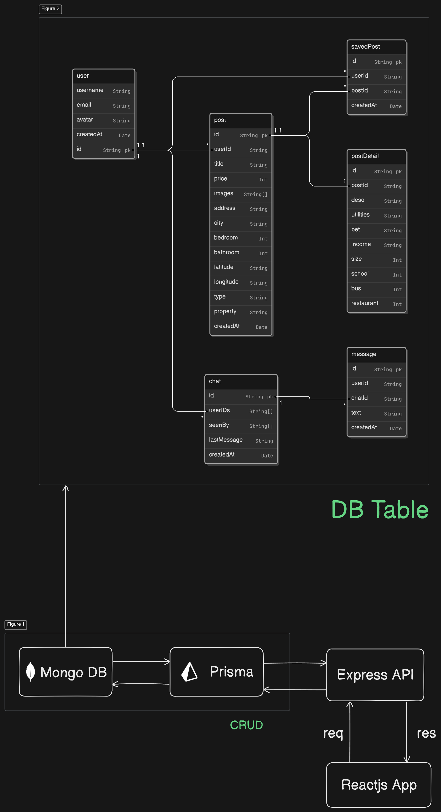

## Modelo de DB

```
{
  user {
    id String pk
    username String
    email String
    avatar String
    createdAt Date
  }
  post {
    id String pk
    userId String
    title String
    price Int
    images String[]
    address String
    city String
    bedroom Int
    bathroom Int
    latitude String
    longitude String
    type String
    property String
    createdAt Date
  }

  postDetail {
    id String pk
    postId String
    desc String
    utilities String
    pet String
    income String
    size Int
    school Int
    bus Int
    restaurant Int
  }

  savedPost {
    id String pk
    userId String
    postId String
    createdAt Date
  }

  chat {
    id String pk
    userIDs String[]
    seenBy String[]
    lastMessage String
    createdAt Date
  }

  message {
    id String pk
    userId String
    chatId String
    text String
    createdAt Date
  }

  user.id < post.userId
  post.id - postDetail.postId
  user.id < savedPost.userId
  post.id < savedPost.postId
  user.id < chat.userIDs
  chat.id < message.chatId
}
```

